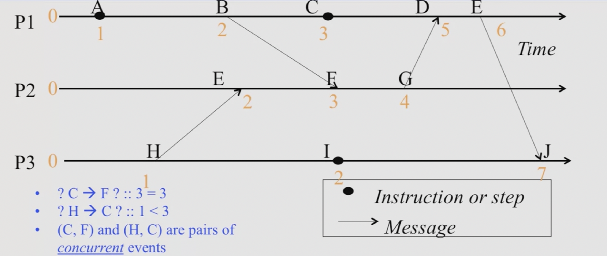

# LAMPORT TIMESTAMPS
- Define a logical relation _Happens-Before_ among pairs of events.
- _Happens-Before_ denoted as _->_
- Creates a `partial` order among events (Not all events related to each other via _->_).

**NOTES:**
The algoritm does not always imply _causality_.

## Definition
- On the same process: a _->_ b, if time(a) < time(b) (using the local clock).
- If p1 sends `m` to p2: send(m) _->_ receive(m)
- (Transivity) If a _->_ b and b _->_ c, then a _->_ c.

## Example

